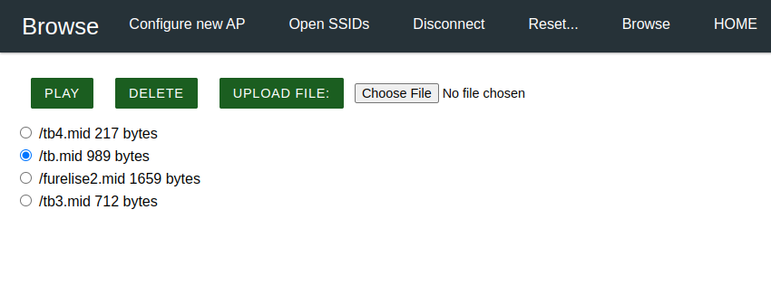

# AutoConnectUpload
 
## Description

This repository contains a demo built with [AutoConnect by Hieromon](https://github.com/Hieromon/AutoConnect) to:

* list the files contained in the SPIFFS filesystem
* upload, play or delete a file
 
using ESP32 or ESP8266.

## Browse Page

## Getting Started

* Download the full repository using zip or git
* Open the folder "AutoConnectUpload" using Visual Studio Code (with PlatformIO already installed)
* Only the very first time, initialize the ESP32 SPIFFS by the PlatformIO "Upload Filesystem Image" command
* Build the PlatformIO AutoConnectUpload project
* Upload it to the ESP32
* The AutoConnect software will create a WiFi hotspot with name esp32ap and password 12345678
* Connect to this hotspot
* (Optional) Connect the ESP32 to your local WiFi network using the menu option "Configure New AP"
* Click on "Browse"
* Enjoy

## License

* MIT
